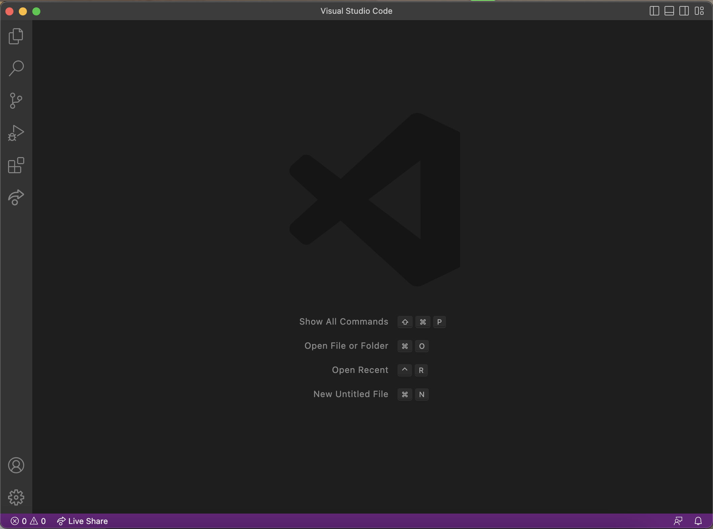
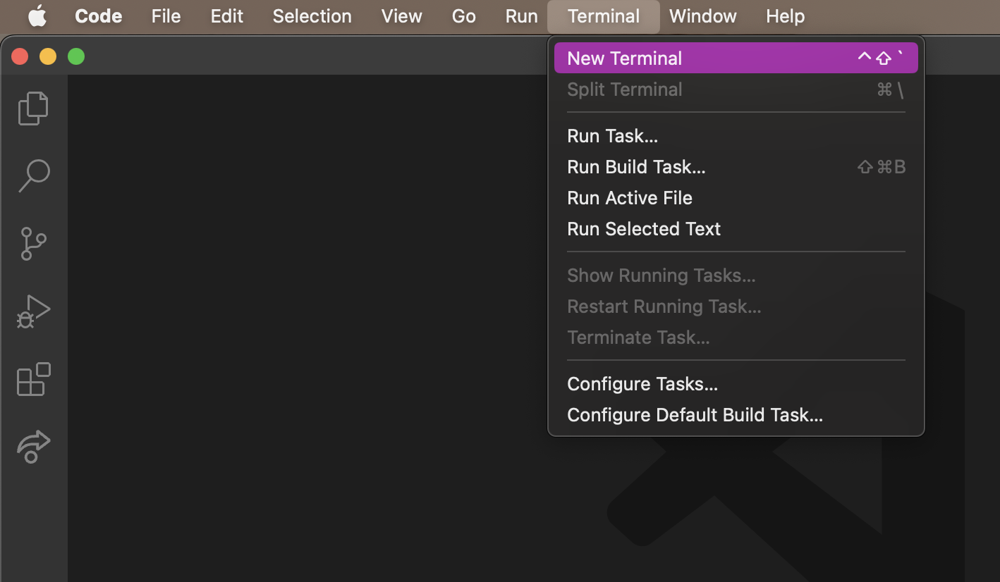

# LAB REPORT 1 - Remote Access and FileSystem
How to log into a course-specific account on ieng6

## **1. CSE15L Account**
Here is the link to look up your account using your ucsd username and PID: [https://sdacs.ucsd.edu/~icc/index.php](https://sdacs.ucsd.edu/~icc/index.php)

After clicking submit, carefully follow the instructions [here](https://drive.google.com/file/d/17IDZn8Qq7Q0RkYMxdiIR0o6HJ3B5YqSW/view?usp=share_link) to reset the CSE 15L account password.

## **2. Visual Studio Code**
If you don't already have Visual Studio Code on your computer or laptop, go to this [link](https://code.visualstudio.com) to download and install the version for your operating system.

After it is done installing, open it up and it should look something like this(can look a little different, like the color or menu bar depending on your system and settings).

## **3. Remote Connect for MacOS users**
Now we will use ssh to connect to a remote computer over the Internet. Open up a terminal in VScode by clicking on "Terminal" located on the upper left corner of your screen where the menu bar is.

