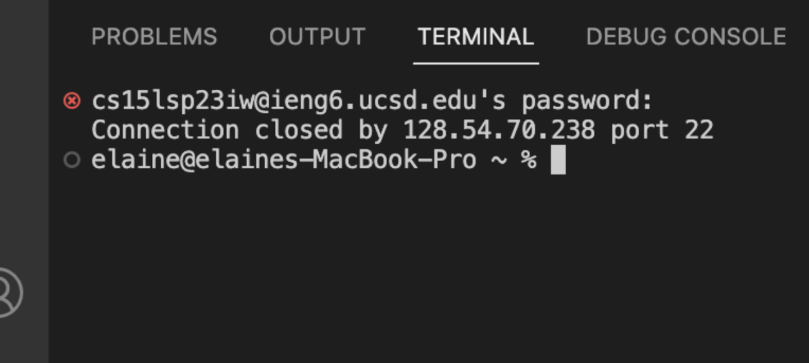
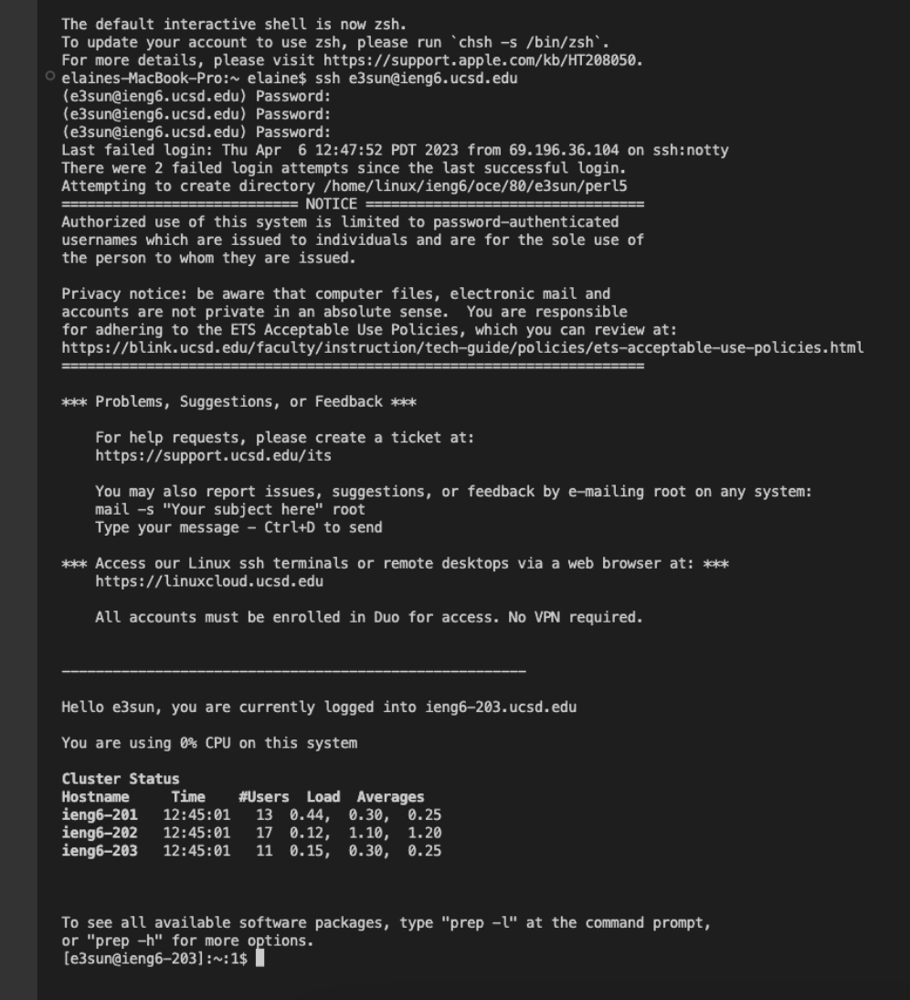

# LAB REPORT 1 - Remote Access and FileSystem
How to log into a course-specific account on ieng6


## **1. CSE15L Account**
Here is the link to look up your account using your ucsd username and PID: [https://sdacs.ucsd.edu/~icc/index.php](https://sdacs.ucsd.edu/~icc/index.php)

After clicking submit, carefully follow the instructions [here](https://drive.google.com/file/d/17IDZn8Qq7Q0RkYMxdiIR0o6HJ3B5YqSW/view?usp=share_link) to reset the CSE 15L account password.


## **2. Visual Studio Code**
If you don't already have Visual Studio Code on your computer or laptop, go to this [link](https://code.visualstudio.com) to download and install the version for your operating system.

After it is done installing, open it up and it should look something like this(can look a little different, like the color or menu bar depending on your system and settings).


## **3. Remote Connect for MacOS users**
Now we will use ssh to connect to a remote computer over the Internet. Open up a terminal in VScode by clicking on "Terminal" located on the upper left corner of your screen where the menu bar is and then click on "New Terminal."


After the terminal pops up, type the following command but `zz` replaced with the last two letters in your course-specific account.\
`ssh cs15lsp23zz@ieng6.ucsd.edu hi`

Click enter and then you will most likely see this message if it is your first time connected to this server:
```
The authenticity of host 'ieng6.ucsd.edu (128.54.70.227)' can't be established.
RSA key fingerprint is SHA256:ksruYwhnYH+sySHnHAtLUHngrPEyZTDl/1x99wUQcec.
Are you sure you want to continue connecting (yes/no/[fingerprint])?
```
Type `yes` and click enter. It will type prompt you to type your password. It will look like nothing is typing as you type, but it is there, so the best is to just copy and paste your password over from your CSE15L account that you resetted at first. Then click enter and it should look something like this.
```
# Now on remote server
Last login: Sun Jan  2 14:03:05 2022 from 107-217-10-235.lightspeed.sndgca.sbcglobal.net
quota: No filesystem specified.
Hello cs15lsp23zz, you are currently logged into ieng6-203.ucsd.edu

You are using 0% CPU on this system

Cluster Status 
Hostname     Time    #Users  Load  Averages  
ieng6-201   23:25:01   0  0.08,  0.17,  0.11
ieng6-202   23:25:01   1  0.09,  0.15,  0.11
ieng6-203   23:25:01   1  0.08,  0.15,  0.11

Sun Jan 02, 2022 11:28pm - Prepping cs15lsp23
```

However, I ran into an issue when I ran my command with a message stating that `Connection to ieng6.ucsd.edu closed by remote host.` 


Instead, the tutor said to use our triton username before the `@ieng6.ucsd.edu`. If you try that instead, put in the same CSE15L accunt password, and click enter. Now your terminal should be connected to a computer in the CSE building. Any of the commands you run in your computer's(client) terminal will run on that computer(server). 


## **4. Commands**


