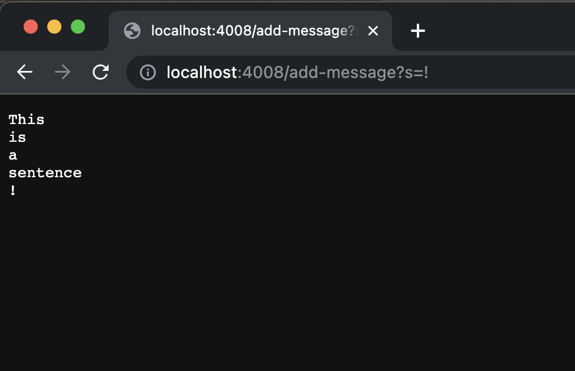
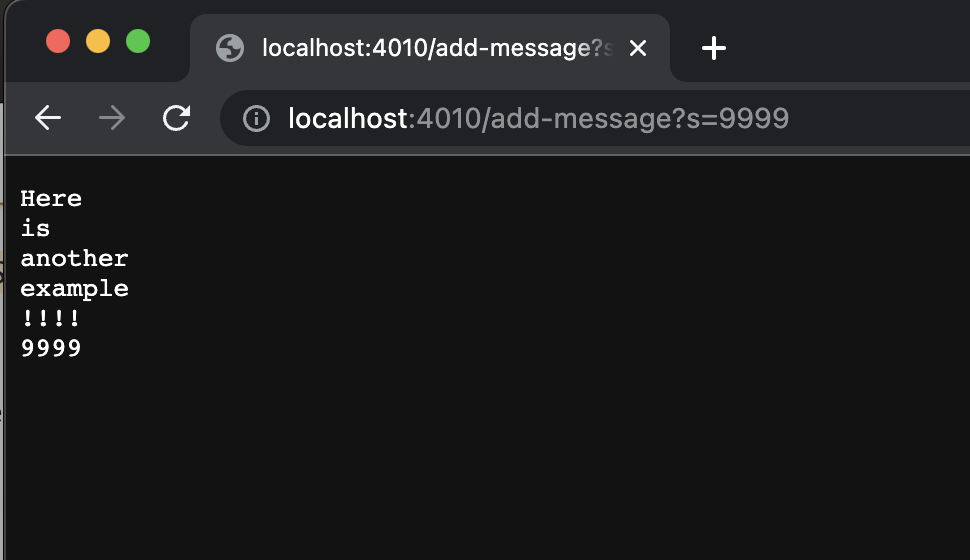

# **LAB REPORT 2**
## **Part 1 - Creating a StringServer**

* Which methods in your code are called?
* What are the relevant arguments to those methods, and the values of any relevant fields of the class?
* How do the values of any relevant fields of the class change from this specific request? If no values got changed, explain why.

By values, we mean specific Strings, ints, URIs, and so on. "abc" is a value, 456 is a value, new URI("http://...") is a value, and so on.)

* Which methods in your code are called?
* What are the relevant arguments to those methods, and the values of any relevant fields of the class?
* How do the values of any relevant fields of the class change from this specific request? If no values got changed, explain why.

* Which methods in your code are called?
* What are the relevant arguments to those methods, and the values of any relevant fields of the class?
* How do the values of any relevant fields of the class change from this specific request? If no values got changed, explain why.

## **Part 2**
Choose one of the bugs from lab 3
