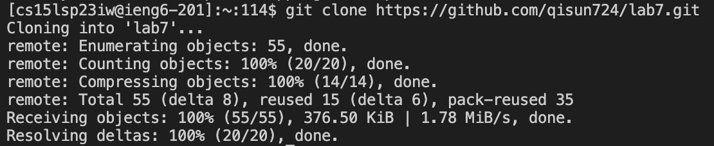

# LAB REPORT 4 - Command Line Tasks

ss at each step, write down exactly what keys you pressed to and commands you ran get to that step, what the effects of those keypresses are(special characters like enter and tab, write them in angle brackets with code formatting)
Keys pressed:
explain why you did that

## Step 1. Log into ieng6

After I delete any exisitng forks of the repository on my account, I forked the repository. Then to log into ieng6, I typed the following command into my terminal but with `zz` replaced with the last two letters in my course-specific account:`ssh cs15lsp23zz@ieng6-201.ucsd.edu`

After I press `<enter>`, it didn't prompt me to put in my password because I generated SSH key for ieng6. If it does prompt you, just copy and paste your 15l account password over to the terminal and press`<enter>`.

## Step 2. Clone the Repository

After logging into ieng6, I cloned the repository that I forked by typing this into the terminal:
`git clone https://github.com/qisun724/lab7.git`
`git clone` basically clones the repository you forked, and the URL after it is the URL of the github repository which you can simply copy and paste over. Then, press `<enter>`.
