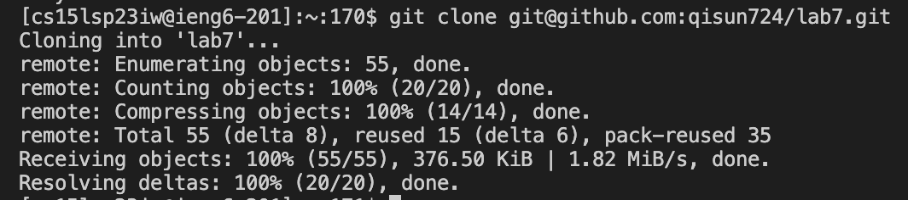

# LAB REPORT 4 - Command Line Tasks

ss at each step, write down exactly what keys you pressed to and commands you ran get to that step, what the effects of those keypresses are(special characters like enter and tab, write them in angle brackets with code formatting)
Keys pressed:
explain why you did that

## Step 1. Log into ieng6

After I delete any exisitng forks of the repository on my account, I forked the repository. Then to log into ieng6, I typed the following command into my terminal but with `zz` replaced with the last two letters in my course-specific account:`ssh cs15lsp23zz@ieng6-201.ucsd.edu`. After I press `<enter>`, it didn't prompt me to put in my password because I generated SSH key for ieng6. If it does prompt you, just copy and paste your 15l account password over to the terminal and press`<enter>`.

## Step 2. Clone the Repository

After logging into ieng6, I cloned the repository that I forked by typing this into the terminal:
`git clone https://github.com/qisun724/lab7.git`

`git clone` basically clones the repository you forked, and the URL after it is the URL of the github repository which you can simply copy and paste over. Then, press `<enter>`.

## Step 3. Run Tests

First, I changed the current directory to lab7 by typing out this into the terminal: `cd lab7` and then pressed `<enter>`. Then to run the tests, I typed `bash test.sh` where bash will run the commands in the bash script,then pressed `<enter>` again.

## Step 4. Edit the Code

To edit the code file `ListExamples.java` to fix the failing test, I typed the following into the terminal to go into the file:`vim ListExamples.java`. If your cursor is not already at the top of the file, press and hold `h` until you hit the cursor left most side of the file. Then press and hold `k` until you see the cursor hit the top most of the file. `h` is essentially the left arrow whereas `k` is the up arrow. Then here are the rest of my keypresses: `/``i``n``d``e``x``1``<Enter>``n``n``n``n``n``n``n``n``n``l``l``l``l``l``l``i``<Backspace>``2``<Escape>``<Shift> :``w``q`.

`/index1` is essnetially like command-f which searches for the appearances of index in the file. Then, I pressed `n` 9 times where it is basically like next to go to the next appearance of index1 in the file everytime you press it. I pressed `l` 6 times because it is like the right arrow so I can move the cursor to the end of the word index1.I pressed `i` which gets into insert mode so I can edit the code. I pressed `<Backspace>` to delete 1 and pressed `2`. Then I pressed `<Escape>` to get out of insert mode. Finally, I typed colon then `wq` to exit out of vim.

## Step 5. Run Tests Again

Now that I changed the code, we run the test again to see if we fixed the failure. I pressed the up arrow 2 times to look through the history for the `bash test.sh`command we did earlier at first. Then I pressed `<Enter>`.

## Step 6. Commit and Push

First, I typed the following command into the terminal: `git add ListExamples.java`. This is bascially like checking the box for this file as if we are on Github desktop. Then, I typed `git commit -m "Edited file"` which saves the changes to the git repository. Finally, I typed `git push main `

