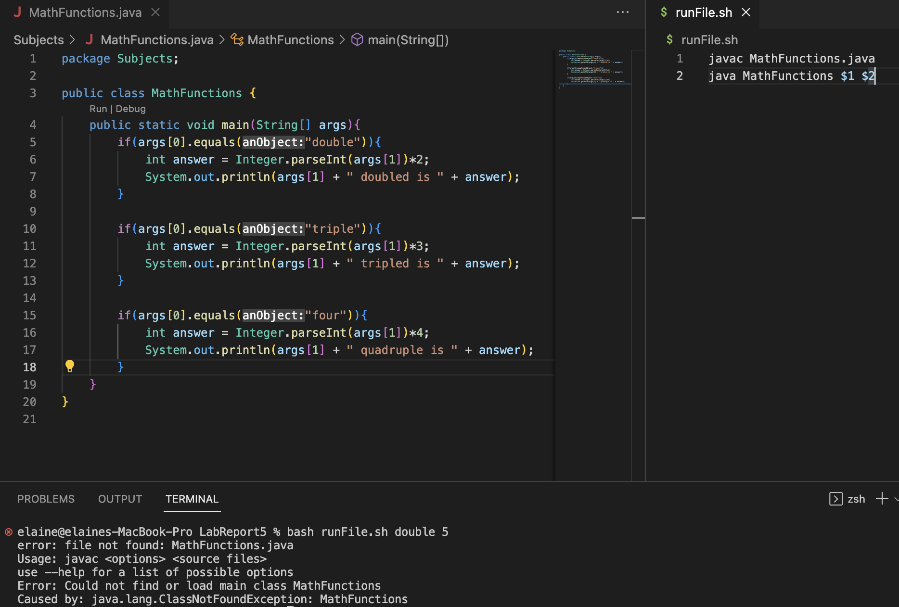
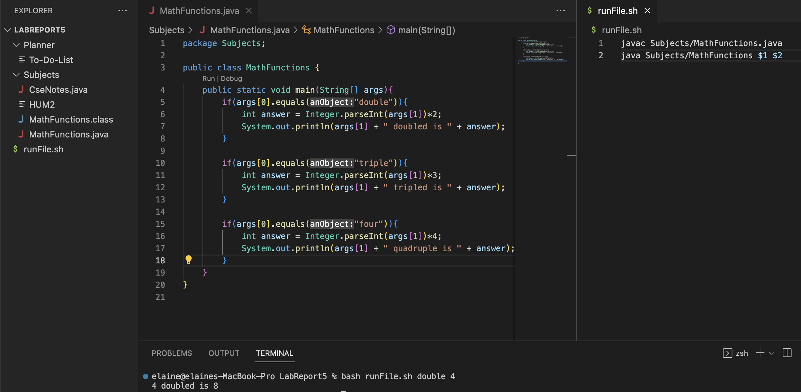
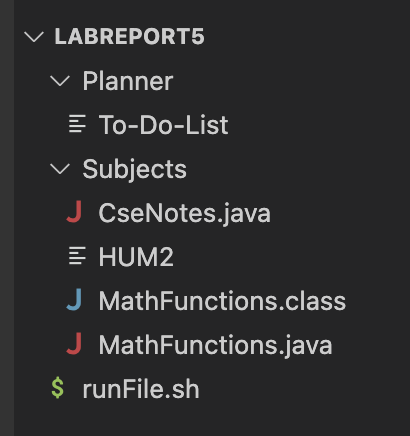

# LAB REPORT 5
## Debugging Scenario
**1. Screenshot of symptom and description of a guess at the bug/what the failure-inducing input it**


Above is a screenshot of the error I kept getting from running the bash script. I think there might be something wrong with my bash script because I have ran through the code I wrote in the MathFunctions.java file and everything is correct. It says MathFunctions.java file not found, but my file is there. What is wrong?

**2. Response from a TA asking leading question or suggesting a command to try**


I think it is possible that it is due to the structure of your files and directory. May I see a screenshot of your file and directory, where everything is? Is your bash script and your MathFunctions.java file in different directories? If it is, then you might have to make some changes to your bash script, such as changing the path of what the MathFunctions.java file is.


**3.  Another screenshot showing student trying that and description of what the bug is**


My bash script and MathFunctions.java are in different directories. I think the bug was definitely in my bash script. Because I am in the LabReport5 directory, the path that I gave after the javac and java command isn't correct. The changes I made was that I put `Subjects/` before MathFunctions.java and MathFunctions because that both of those files are in the Subjects directory.


**4.  All info needed about the setup: file and directory structure, contents of each file before fixing the bug, full command line ran to trigger the bug, description of what to edit to fix**



The only file that changed was runFile.sh and here is before fixing the bug:
```
javac MathFunctions.java
java MathFunctions $1 $2
```

Here is after fixing the bug:
```
javac Subjects/MathFunctions.java
java Subjects/MathFunctions $1 $2
```

The full command line ran to trigger the bug:
```
bash runFile.sh double 4
```

To fix the bug, we simply gave javac and java the right path to the MathFunctions.file because runFile.sh and MathFunctions files are not in the same directory. If they are, then we would not need to put that additional stuff in front of it.


## Reflection
I have never used vim or heard of it before, so I learned about it in class, it was very intriguing. One very cool thing that I like about it is that it allows us to create and edit files from our command line even though it can get a little confusing learning all the different key strokes for different purposes. I thought that being able to remote login to ieng6 is also cool because I get to work on the remote terminal locally on my laptop. By combining these two ideas, I think it will allow me to work on my coding assignments from any terminal on any computer. 
